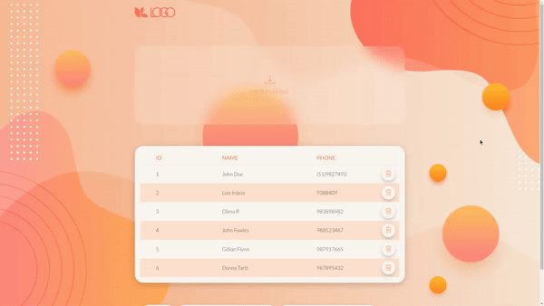

### PROJETO DRAG N DROP

O objetivo do projeto foi criar uma página onde fosse possível carregar um arquivo CSV via drag and drop, dando origem a uma tabela. No caso deste projeto, a tabela possui três campos (id, nome e número) e é possível adiciona e remover itens da tabela.

#### Funcionamento drag and drop
  A dropzone possui design simples e discreto para não sobressaltar na página.

  

#### Funcionamento excluindo item
  Os botões para excluir arquivo possuem animação e cor de destaque para evitar erros e chamar atenção.

  

#### Funcionamento adicionando item
  A aplicação permite que sejam adicionadas novas linhas de forma fácil.

  

- Node v14.17.5
